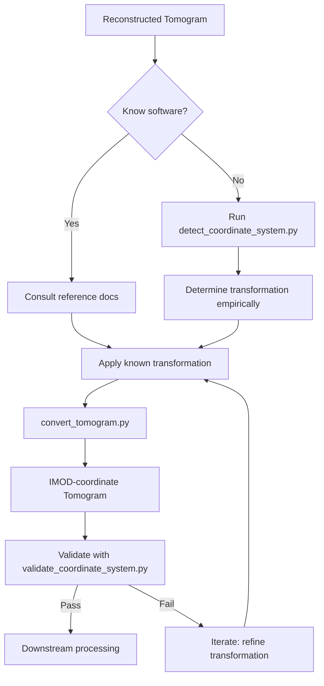

# Coordinate System Transformation

## Overview

Different cryo-ET reconstruction software may internally modify the tomogram coordinate system for various reasons — GPU memory layout optimization, historical convention inheritance, numerical algorithm constraints, or design choices by the developers.

When downstream processing tools (particle picking, subtomogram extraction, template matching) assume **IMOD's coordinate system**, a mismatch in coordinates can lead to:

- Particles extracted at wrong 3D positions
- Subtomograms with incorrect orientation
- Alignment and averaging failures
- Template matching in wrong regions

This skill provides:

1. **Reference documentation** of each reconstruction tool's coordinate system relative to IMOD
2. **Source code analysis patterns** to determine coordinate conventions from source code
3. **Transformation scripts** to convert tomograms between coordinate systems

---

## Position in the cryo-ET Pipeline

```
Tilt Series → Alignment → [Reconstruction] → [Coordinate Transform] → Particle Picking → Subtomograms
                                        ↑
                                   This skill
```

Coordinate transformation sits **immediately after tomogram reconstruction** and **before any downstream analysis** that depends on spatial coordinates (particle picking, subtomogram extraction, template matching, STA).

---

## Why IMOD as the Reference

IMOD is chosen as the canonical reference because:

| Reason | Detail |
|--------|--------|
| **De facto standard** | IMOD's coordinate conventions are the most widely documented and referenced in the cryo-ET community |
| **Open source** | Full source code is available for verification |
| **Most downstream tools** | Particle picking tools (Dynamo, pyTOM, crYOLO in IMOD mode), subtomogram extraction, and template matching software all default to IMOD coordinates |
| **Well-defined convention** | IMOD uses a consistent right-handed coordinate system with clear axis definitions |
| **EMPIAR/CellMap standard** | Most public datasets in EMPIAR and CellMap follow IMOD conventions |

---

## IMOD Reference Coordinate System

```
Z (beam direction / sections)
│
│   ┌──────────────────────────┐
│  /                          /│
│ /    Tomogram Volume        / │
│/                          /  │
└──────────────────────────┘   │
│                          │   │
│                          │  /
│                          │ /
│                          │/
└──────────────────────────┘─── Y (tilt axis)
                           /
                          /
                         /
                        X (perpendicular to tilt axis, in-plane)
```

| Axis | IMOD Definition | MRC Header | Typical Range |
|------|----------------|------------|---------------|
| **X** | In-plane, perpendicular to tilt axis | `nx` (fast axis) | 0 to NX-1 (voxels) |
| **Y** | Tilt axis direction | `ny` | 0 to NY-1 (voxels) |
| **Z** | Beam direction / sections / depth | `nz` (slow axis) | 0 to NZ-1 (voxels) |

### Key IMOD Conventions

- **Handedness**: Right-handed
- **Origin**: Center of volume by default (`origin = (NX/2, NY/2, NZ/2)`)
- **MRC header origin fields**: `nxstart`, `nystart`, `nzstart` set the subvolume origin; the volume origin in Angstroms is stored in `origin.x`, `origin.y`, `origin.z` (MRC 2014 extension)
- **Voxel size**: `cella.x / nx`, `cella.y / ny`, `cella.z / nz` (Angstroms)
- **Rotation in .xf files**: IMOD uses a specific rotation matrix convention (A, B, C as rotation matrix elements applied to X and D, E, F for Y)

---

## Input / Output

### Input

| Input | Description |
|-------|-------------|
| Source tomogram | `.mrc` / `.rec` file from any reconstruction tool |
| Source software identity | Name and version of the reconstruction software (e.g., "AreTomo 1.3.4", "Warp 1.0.9") |
| Tilt series metadata (optional) | `.tlt`, `.rawtlt`, `.xf`, `.mdoc` files for validation |
| Source code access (optional) | Path to reconstruction software source code for detailed analysis |

### Output

| Output | Description |
|--------|-------------|
| Transformed tomogram | `.mrc` file in IMOD coordinate system |
| Transformation matrix | The 4×4 affine matrix applied (stored in `imod_transform.txt`) |
| Coordinate mapping report | Documents which axes were transformed and how |

---

## Reconstruction Tools and Their Coordinate Conventions

### Summary Matrix

| Software | X → IMOD X? | Y → IMOD Y? | Z → IMOD Z? | Handedness | Notable Difference |
|----------|-------------|-------------|-------------|------------|--------------------|
| **IMOD** | ✓ (reference) | ✓ (reference) | ✓ (reference) | Right | None |
| **AreTomo** | Varies by GPU kernel | Inverted in some versions | May be swapped with Y | May flip | GPU memory layout causes transpositions |
| **Warp** | ✓ | ✓ | **Flipped Z** | Right | Z-axis sign flipped relative to IMOD |
| **RELION-tomo** | ✓ | ✓ (may swap with Z) | May be swapped | Varies | Pseudosubtomogram coordinates differ |
| **novaCTF** | ✓ | ✓ | ✓ | Right | Subvolume shifts; uses IMOD alignment |
| **emClarity** | Flipped X | Flipped Y | Swapped/signed | May differ | MATLAB array conventions; uses GPU |
| **PyTOM** | Follows IMOD | Follows IMOD | Follows IMOD | Right | Defaults to IMOD convention |

> **Note**: These conventions can vary between software versions. Always verify against the specific version used. Detailed per-tool references available in `./reference/`.

### How to Detect the Coordinate System

When the source software is known, consult the reference documents in `./reference/`. When analyzing a new or unknown software, use the following approaches:

#### 1. Source Code Inspection (`scripts/detect_coordinate_system.py`)

Look for these patterns in the source code:

- **Array indexing order**: Fortran (column-major) vs C/C++ (row-major) determines which axis is "fast"
- **FFT transformations**: FFTW (C-style) vs cuFFT (Fortran-style) indexing can indicate axis conventions
- **Projection geometry**: How the software applies rotation matrices to the tilt series
- **Back-projection direction**: The sign of the back-projection operation reveals Z-axis direction
- **Volume write order**: Which axis is iterated in the outermost loop when writing the output MRC

#### 2. Empirical Validation

Use `scripts/validate_coordinate_system.py` to:

1. Reconstruct a known test object (e.g., a gold fiducial dataset) with both IMOD and the target software
2. Cross-correlate the two volumes in 3D
3. Determine the transformation (flip, swap, rotation) that maximizes correlation
4. Output the best-fit transformation matrix

#### 3. Metadata Comparison

- Compare `.xf` alignment files between IMOD and the target software
- Check if the software's convention documentation exists (README, manual, paper methods)
- Look for coordinate-related parameters in the software's configuration files

---

## Common Transformation Operations

### Axis Swaps

```python
# X ↔ Y swap
vol_imod = np.transpose(vol_source, (1, 0, 2))

# Y ↔ Z swap (common in GPU-based tools)
vol_imod = np.transpose(vol_source, (0, 2, 1))
```

### Axis Flips

```python
# Flip X
vol_imod = np.flip(vol_source, axis=0)

# Flip Z (Warp → IMOD)
vol_imod = np.flip(vol_source, axis=2)
```

### Origin Shifts

```python
# Shift origin from (0,0,0) to (NX/2, NY/2, NZ/2)
vol_imod = np.roll(vol_source, shift=(NX//2, NY//2, NZ//2), axis=(0, 1, 2))
```

### Full Affine Transformation

A general 4×4 affine matrix can represent any combination of the above:

```python
# affine_matrix: 4x4 matrix encoding rotation, scaling, translation
from scipy.ndimage import affine_transform
vol_imod = affine_transform(vol_source, affine_matrix[:3, :3], offset=affine_matrix[:3, 3])
```

---

## Scripts

### 1. `scripts/convert_tomogram.py`

Convert a tomogram from a known reconstruction software's coordinate system into IMOD's.

```bash
python scripts/convert_tomogram.py \
    --input reconstructed_tomo.mrc \
    --source aretomo \
    --output imod_tomo.mrc \
    --save-transform imod_transform.txt
```

### 2. `scripts/detect_coordinate_system.py`

Analyze the source code of a reconstruction tool to identify its coordinate convention. See `./reference/software_coordinate_patterns.md` for the patterns used.

```bash
python scripts/detect_coordinate_system.py \
    --source-dir /path/to/aretomo/src \
    --language cuda \
    --output coordination_report.json
```

### 3. `scripts/validate_coordinate_system.py`

Empirically validate the coordinate system of a tomogram by comparing against an IMOD reconstruction of the same data.

```bash
python scripts/validate_coordinate_system.py \
    --source-tomo source_tomo.mrc \
    --imod-tomo imod_tomo.mrc \
    --output transformation_matrix.txt
```

---

## Workflow



---

## Common Pitfalls

| Pitfall | Consequence | Prevention |
|---------|-------------|------------|
| Assuming all MRC volumes are right-handed | Left-handed volume produces mirrored subtomograms | Always verify hand with fiducial cross-correlation |
| Ignoring version differences | Transformation that works for v1.3 fails for v2.0 | Pin software version in metadata; re-verify after upgrades |
| Neglecting subvolume offsets | Subtomograms extracted at shifted positions | Check `nxstart/nystart/nzstart` in MRC headers |
| Confusing pixel vs. physical coordinates | Wrong scaling in downstream tools | Ensure `cella` fields in MRC header are updated after transform |
| Applying transformation twice | Double correction destroys coordinates | Track applied transforms in tomogram metadata |
| Not propagating coordinate changes to particle coordinates | Particle coordinates point to wrong locations | Transform particle coordinate files along with the tomogram |

---

## Tools

1. **IMOD** — The reference coordinate system. Detailed reference: `./reference/imod_coordinate_system.md`
2. **AreTomo** — GPU-accelerated tomogram reconstruction. Detailed reference: `./reference/aretomo_coordinate_system.md`
3. **RELION-tomo** — Bayesian tomogram reconstruction and STA. Detailed reference: `./reference/relion_coordinate_system.md`
4. **Warp** — Real-time processing framework with integrated reconstruction. Detailed reference: `./reference/warp_coordinate_system.md`
5. **Source Code Analysis** — Generic patterns for detecting coordinate conventions. Detailed reference: `./reference/software_coordinate_patterns.md`
